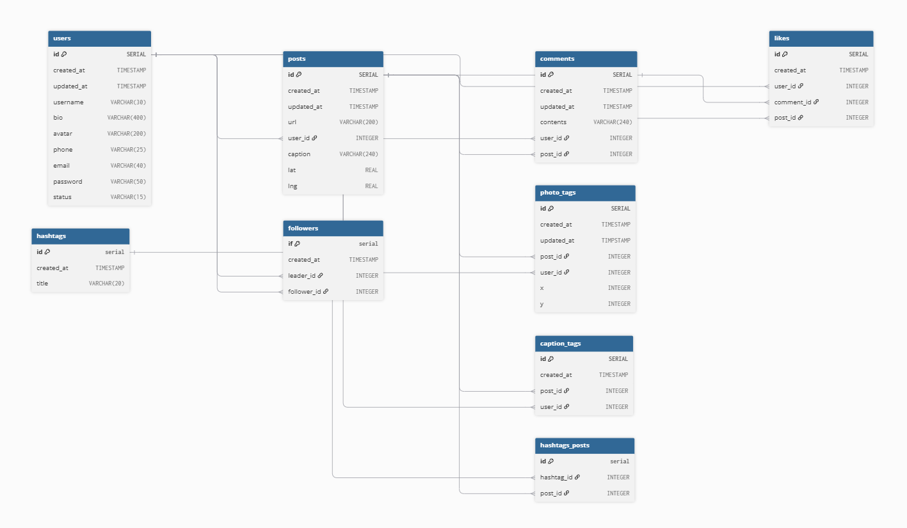

# Instagram Database — PostgreSQL

A PostgreSQL database project that models the core data structure of an Instagram-like social media platform.

This project was built to strengthen practical SQL and PostgreSQL skills through database design, relational modeling, querying, indexing, query analysis, CTEs, recursive queries, views, and materialized views.

---

## 📌 Project Overview

The database represents common Instagram-style features such as:

* User profiles
* Posts
* Comments
* Likes
* Followers
* Photo tags
* Caption tags
* Hashtags
* Hashtag-post relationships

The project also includes advanced PostgreSQL concepts for understanding and optimizing query performance.

---

## 🗂️ Database Schema

The main entities in the database are:

| Table            | Description                                  |
| ---------------- | -------------------------------------------- |
| `users`          | Stores user profile information              |
| `posts`          | Stores posts created by users                |
| `comments`       | Stores comments made on posts                |
| `likes`          | Stores likes on posts and comments           |
| `followers`      | Manages follower relationships between users |
| `photo_tags`     | Stores users tagged in photos                |
| `caption_tags`   | Stores users tagged in captions              |
| `hashtags`       | Stores available hashtags                    |
| `hashtags_posts` | Connects hashtags with posts                 |

### ER Diagram



---

## 🛠️ Technologies Used

* **PostgreSQL**
* **SQL**
* **pgAdmin**
* **Git & GitHub**

---

## 📁 Project Structure

```text
Instagram-Database/
│
├── README.md
│
├── schema/
│   └── tables.sql
│
├── data/
│   └── ig.sql
│
├── queries/
│   ├── basic_queries.sql
│   ├── advanced_queries.sql
│   │
│   └── query_optimization/
│       ├── simplifying_queries_with_views.sql
│       ├── simple_common_table_expressions.sql
│       ├── recursive_common_table_expressions.sql
│       └── optimizing_queries_with_materialized_view.sql
│
└── ERD/
    └── instagram_erd.png
```

---

## 🧱 Database Design

The schema uses several PostgreSQL relational database concepts.

### Primary Keys

Each major table contains a primary key to uniquely identify its records.

### Foreign Keys

Relationships between tables are implemented using foreign keys.

For example:

```sql
user_id INTEGER NOT NULL
REFERENCES users(id)
ON DELETE CASCADE
```

### Constraints

The database uses:

* `PRIMARY KEY`
* `FOREIGN KEY`
* `UNIQUE`
* `CHECK`
* `NOT NULL`

These constraints help maintain data integrity and enforce relationships between entities.

---

## 📊 Dataset

The project includes a dataset containing the data used to populate and test the Instagram database.

The dataset is located at:

```text
data/ig.sql
```

The schema and dataset are kept separate so that the database structure can be understood independently from the data.

---

## 🔍 SQL Concepts Practiced

### Basic Queries

The project includes queries using:

* `SELECT`
* `WHERE`
* `ORDER BY`
* `LIMIT`
* `JOIN`
* `GROUP BY`
* Aggregate functions such as `COUNT()`

Example:

```sql
SELECT
    users.username,
    COUNT(likes.id) AS like_count
FROM users
JOIN likes
    ON likes.user_id = users.id
GROUP BY users.username;
```

---

## ⚡ Advanced PostgreSQL

The project explores PostgreSQL-specific concepts such as:

### Indexes

Indexes are created and tested to understand their effect on query performance.

```sql
CREATE INDEX users_username_idx
ON users(username);
```

### EXPLAIN

Used to inspect the query execution plan.

```sql
EXPLAIN
SELECT *
FROM users
WHERE username = 'Emil30';
```

### EXPLAIN ANALYZE

Used to execute a query and analyze its actual execution performance.

```sql
EXPLAIN ANALYZE
SELECT *
FROM users
WHERE username = 'Emil30';
```

### PostgreSQL System Catalogs

The project also explores PostgreSQL system information using:

* `pg_database`
* `pg_class`
* `pg_stats`

---

## 🚀 Query Optimization

The `query_optimization` section focuses on techniques for simplifying and optimizing SQL queries.

### Views

Views are used to simplify frequently used queries.

Examples include:

* Unified tags view
* Recent posts view

### Common Table Expressions

CTEs using the `WITH` clause are used to make complex queries easier to structure and understand.

### Recursive CTEs

Recursive CTEs are used to explore follower relationships and generate user suggestions across multiple levels.

### Materialized Views

A materialized view is used to store precomputed weekly like statistics.

```sql
CREATE MATERIALIZED VIEW weekly_likes AS
SELECT
    date_trunc(
        'week',
        COALESCE(posts.created_at, comments.created_at)
    ) AS week,
    COUNT(posts.id) AS num_likes_for_posts,
    COUNT(comments.id) AS num_likes_for_comments
FROM likes
LEFT JOIN posts
    ON posts.id = likes.post_id
LEFT JOIN comments
    ON comments.id = likes.comment_id
GROUP BY week
ORDER BY week
WITH DATA;
```

The materialized view can be refreshed when the underlying data changes:

```sql
REFRESH MATERIALIZED VIEW weekly_likes;
```

---

## 📚 What I Practiced

Through this project, I practiced:

* Relational database design
* Entity relationships
* Primary and foreign keys
* Data integrity constraints
* SQL joins
* Filtering and sorting
* Aggregation and grouping
* PostgreSQL indexes
* Query benchmarking
* Query execution plans
* `EXPLAIN ANALYZE`
* PostgreSQL system catalogs
* Views
* Common Table Expressions
* Recursive CTEs
* Materialized Views
* Query optimization

---

## ▶️ How to Run

### 1. Clone the repository

```bash
git clone https://github.com/connectwithaadi/SQL-Projects/tree/main/Instagram%20Database
cd Instagram-Database
```

### 2. Create a PostgreSQL database

Create a new PostgreSQL database using PostgreSQL or pgAdmin.

### 3. Create the database tables

Run:

```text
schema/tables.sql
```

This creates the database structure and relationships.

### 4. Load the dataset

After creating the tables, load:

```text
data/ig.sql
```

This populates the database with the project dataset.

### 5. Run the queries

Execute the SQL files inside the `queries` directory to explore the database and practice different PostgreSQL concepts.

---

## 🎯 Project Purpose

The main purpose of this project is to build strong PostgreSQL and database fundamentals through a realistic social-media database design.

This project is part of my **AI Engineer learning journey**, where database fundamentals are being developed alongside backend development, AI applications, and deployment skills.

---

## 🔮 Future Improvements

Possible future extensions include:

* Build a REST API using FastAPI
* Connect the PostgreSQL database to a backend application
* Containerize the application using Docker
* Add authentication and authorization
* Deploy the application

---

## 👨‍💻 Author

Aditya Kumar Singh

---

## 📄 License

This project is intended primarily for **learning and portfolio purposes**.

If you choose to make it open source, add an appropriate license such as the MIT License.
